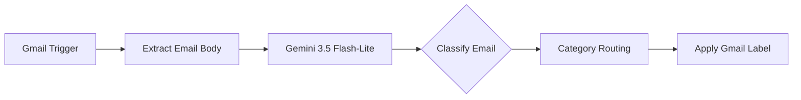

# MailTriage

**AI-Powered Email Classification & Triage Pipeline**

MailTriage is an automated email organization workflow that uses AI to classify incoming Gmail messages based on their content and automatically apply the appropriate Gmail label.

## Problem

Important emails can easily get mixed with security alerts, receipts, app notifications, work messages, and other automated emails.

Manually organizing these emails is repetitive and inconsistent.

## Solution

MailTriage automatically monitors incoming emails, analyzes the email body using an LLM, classifies the message into one of eight categories, and applies the corresponding Gmail label.

## Categories

| Label                          | Description                                                                                                |
| ------------------------------ | ---------------------------------------------------------------------------------------------------------- |
| **Action**                     | Emails requiring a meaningful response, decision, approval, submission, update, or other task.             |
| **Accounts & Security**        | Authentication, verification codes, login activity, password changes, account access, and security alerts. |
| **Money**                      | Payments, purchases, receipts, invoices, refunds, billing, banking, and subscription transactions.         |
| **App & System Notifications** | Automated app activity, system alerts, mentions, reports, status updates, and operational notifications.   |
| **Personal & Life**            | Personal correspondence, travel, reservations, appointments, deliveries, and other personal activities.    |
| **Work**                       | Professional communication, projects, clients, meetings, workplace updates, and business-related messages. |
| **Reading & Promotions**       | Newsletters, marketing emails, promotions, product announcements, recommendations, and optional reading.   |
| **Records**                    | Important archival or reference information that does not require further action.                          |

## Workflow

## Tech Stack

* **n8n** — Workflow automation and orchestration
* **Gmail API** — Email ingestion and label management
* **Google Gemini 3.5 Flash-Lite** — Email content classification
* **Gmail Search & Filters** — Initial inbox filtering and noise reduction
