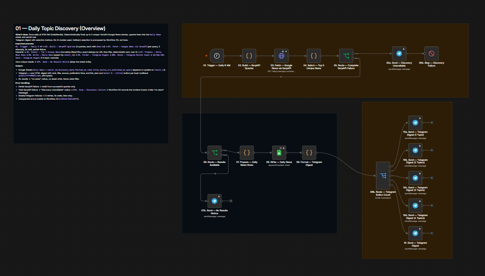
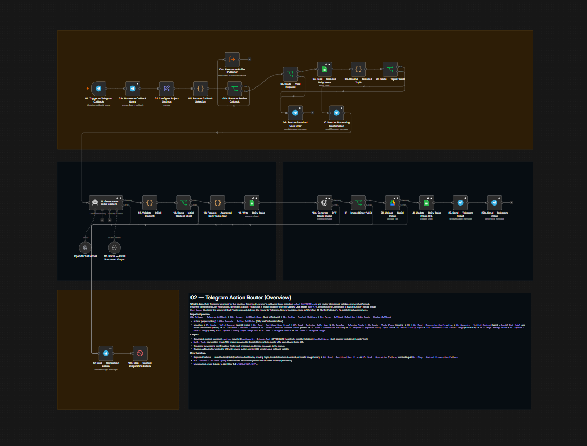
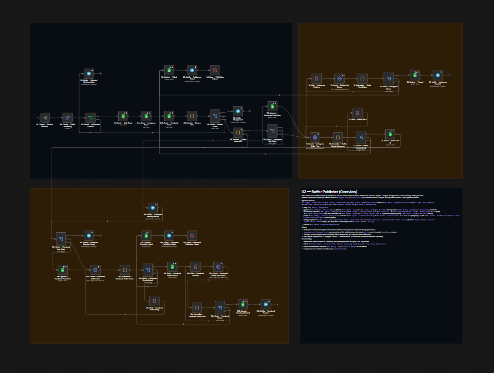
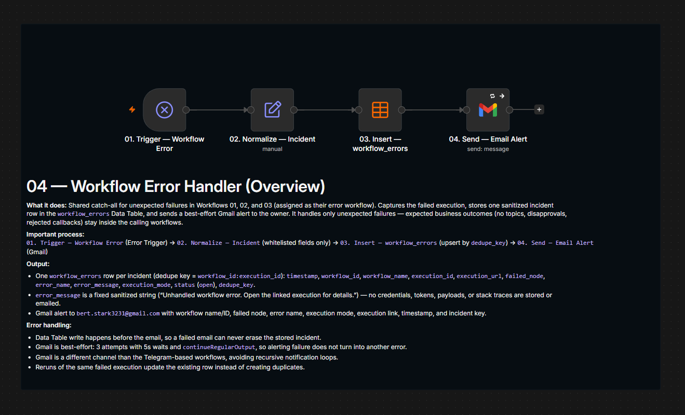
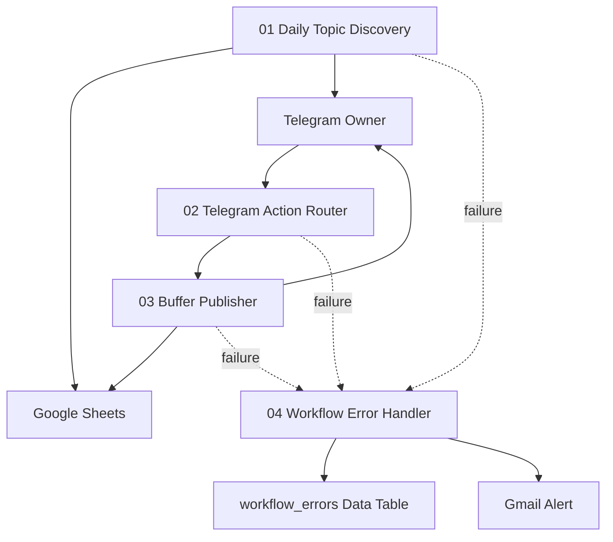

# AI News Pipeline

## Short Description

Your daily Tech/AI news, curated and posted for you.

## The Problem

Manually scanning the news for relevant Tech/AI stories, writing captions, creating images, and posting the same content to multiple platforms is time-consuming and inconsistent. Each step lives in a different tool, mistakes (duplicate posts, off-brand captions, missed deadlines) are easy, and nothing is tracked. This pipeline replaces the manual routine with one repeatable daily flow — automation does the heavy lifting, while the owner keeps control at every decision point.

## Technology Stack

| Layer | Technology |
|---|---|
| Orchestration | Self-hosted n8n (Asia/Manila timezone) |
| News discovery | SerpAPI Google News API (4 daily queries) |
| Content generation | DeepSeek V4 chat (`deepseek-v4-flash`) — caption, hashtags, headline, highlight words |
| Image generation | OpenAI GPT Image — 4:5 (1024×1536), medium quality |
| Human interaction | Telegram Bot (owner-only callbacks) |
| State & history | Google Sheets (Daily News, Daily Topic, Instagram Posts, Facebook Posts) |
| Public image delivery | Google Drive |
| Social publishing | Buffer API (Instagram Feed + Facebook Page Feed) |
| Error logging | n8n Data Table (`workflow_errors`) |
| Error alerting | Gmail |

## The Workflows

### 01 — Daily Topic Discovery

- Runs automatically every day at 9:00 AM (Asia/Manila), including weekends
- Searches Google News via SerpAPI using four focused Tech/AI queries
- Filters and deduplicates stories, then selects up to five unique, credible topics (never adds filler)
- Saves the day's topics to Google Sheets
- Sends a Telegram digest with inline selection buttons for the owner
- Tolerates partial query failures; total failure notifies the owner and triggers the shared error handler

### 02 — Telegram Action Router

- Handles all Telegram callbacks: topic selection, approval, rejection, revision, and retry
- Validates that only the configured owner can act on a batch
- Resolves the selected story and records the daily topic
- Generates the caption, three hashtags, headline, and highlight words using DeepSeek V4 (`deepseek-v4-flash`)
- Creates a branded 4:5 social image with OpenAI GPT Image
- Uploads the image to Google Drive and verifies the public URL before review
- Sends the final content to Telegram for owner approval, with at most two delivered versions (V1 + one revision)

### 03 — Buffer Publisher

- Triggered by the owner's review decision from Workflow 02
- Confirms the image URL is publicly accessible before any publishing call
- Publishes the approved caption and image to Instagram Feed and Facebook Page Feed via Buffer
- Tracks each platform in its own Google Sheets tab and stores Buffer post IDs to prevent duplicates
- Polls delivery status for both platforms in parallel with bounded retries
- Handles partial failures independently: keeps the successful post live and retries only the failed platform
- Sends Telegram confirmations for posted, failed, and already-posted outcomes

### 04 — Workflow Error Handler

- Shared catch-all error workflow assigned to Workflows 01, 02, and 03
- Normalizes and sanitizes incident metadata (no credentials, tokens, or sensitive payloads)
- Records every incident in the `workflow_errors` Data Table
- Sends a best-effort Gmail alert after the row is written

## The Outcome

A successful daily run produces no more than one approved post concept, publishes it to both Instagram and Facebook, records each platform's result independently in Google Sheets, and confirms delivery to the owner in Telegram. No manual news scanning, no duplicate posts, no missed approvals — and every failure is captured in one auditable place.

## Mermaid Diagram

